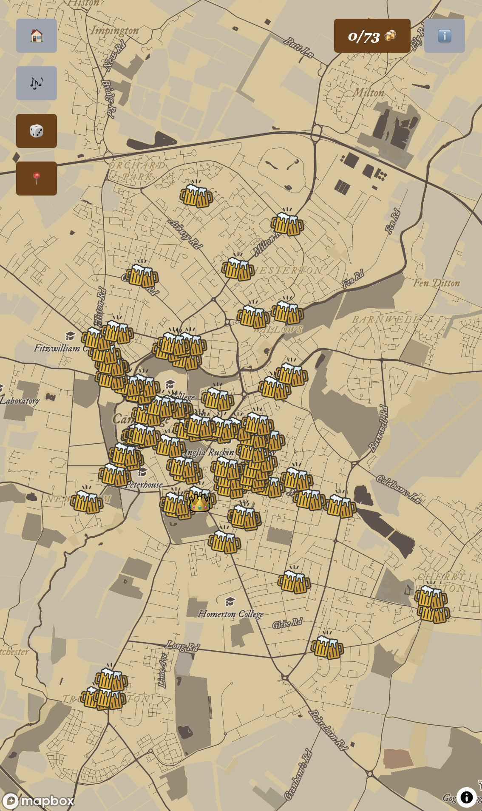
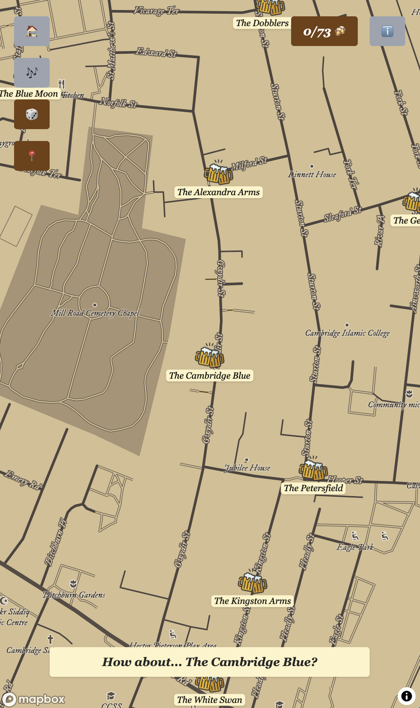
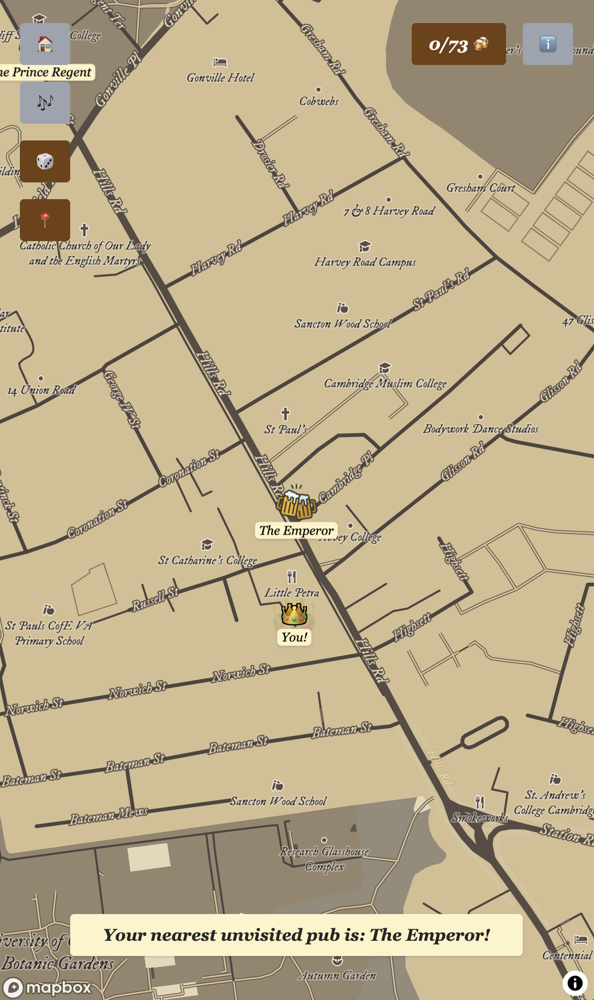

# Pubs of Cambridge

## Project Overview

Pubs of Cambridge is a full-stack web application built with **React**, **Node.js/Express**, and **MongoDB** that helps users discover and track every pub in Cambridge through an interactive map-based experience.

The platform combines location data, pub information, and personal progress tracking to create a digital pub checklist for Cambridge residents, students, and visitors.

### Key Features

* **Interactive map** displaying all pubs across Cambridge that keeps track of visited and unvisited pubs 
* **Random pub recommendation** for spontaneous exploration 
* **Nearest unvisited pub finder** based on the user's location 

---

# Environment Configuration

Two environment files are required for local development: `/client/.env` and `/server/.env.server`
Sample versions of both files are included in the repository.

---

# Local Development

### Frontend

From the `/client` directory:

```bash
npm run dev
```

### Backend

From the `/server` directory:

```bash
node --env-file=.env.server server
```

---

# Production Deployment

### Frontend

https://pubsofcambridge.vercel.app/

### Backend API

https://pub-map.onrender.com/
